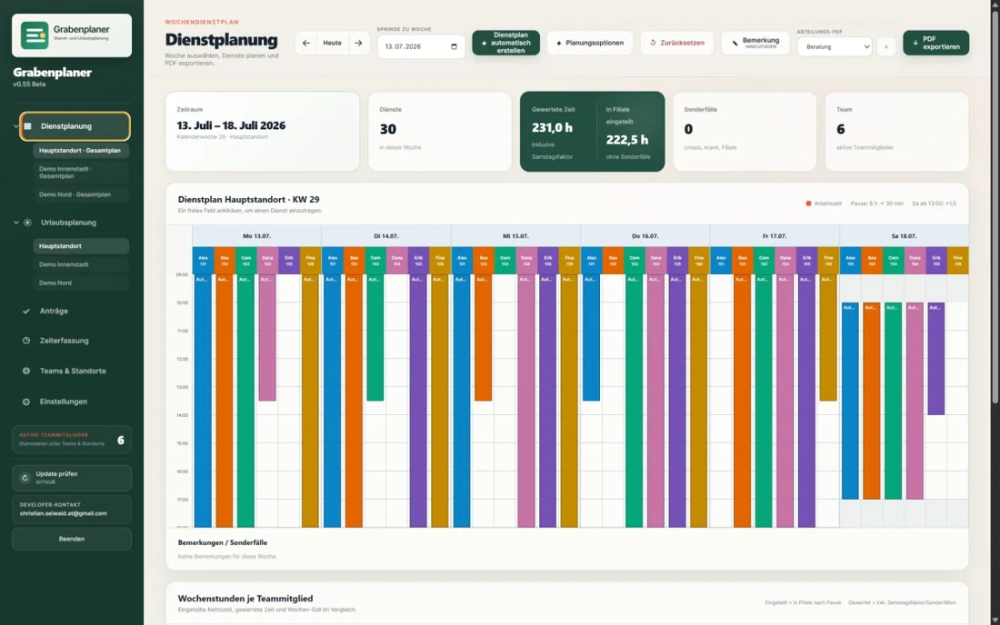
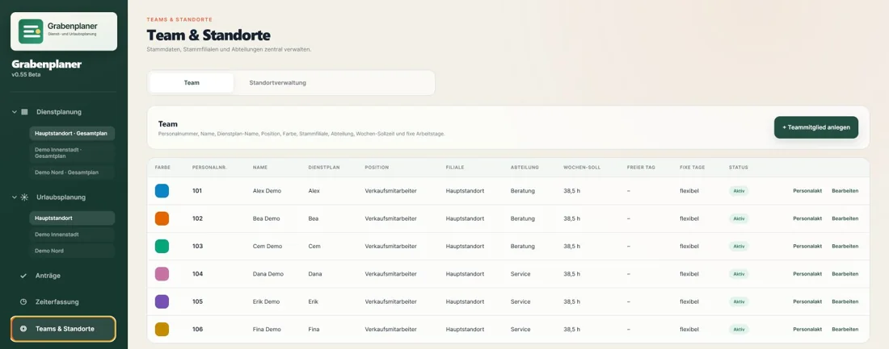
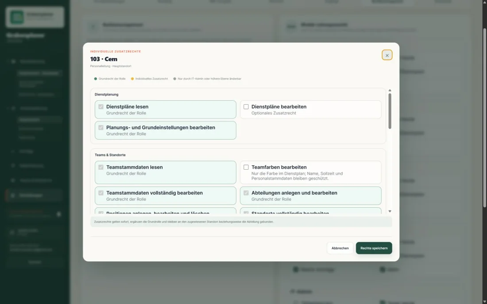
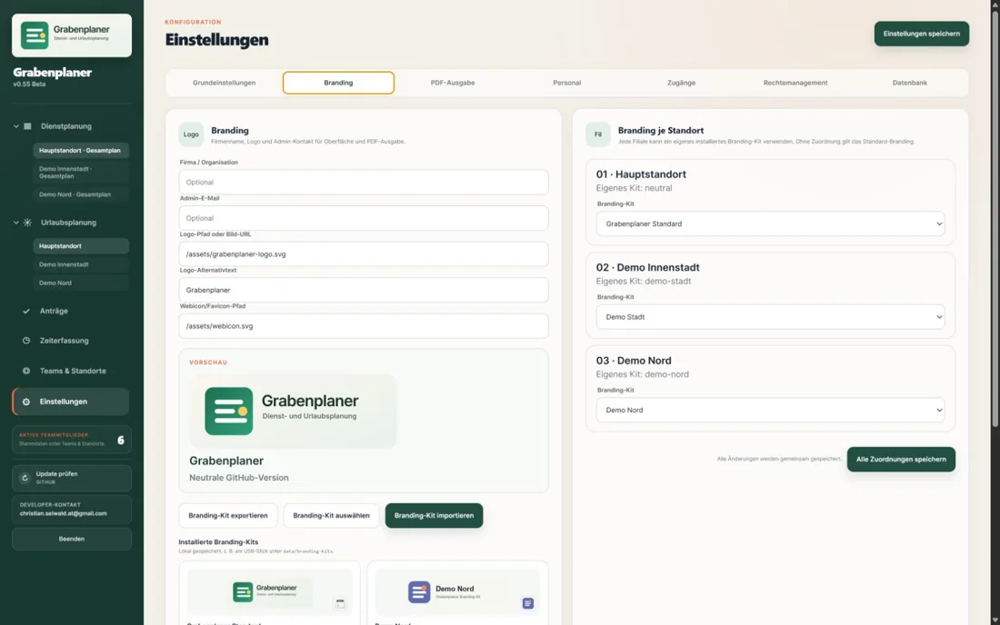
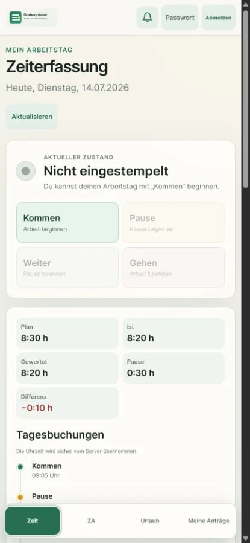
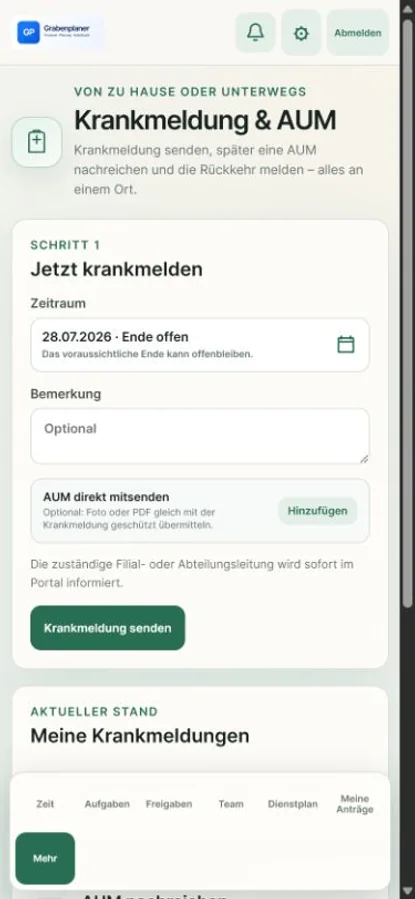

# Grabenplaner

Grabenplaner bündelt Dienstplanung, Abwesenheiten, Personalorganisation, Zeiterfassung und ein mobiles Mitarbeiterportal in einer Anwendung.

**v0.92.59 Beta · verwalteter Ubuntu-Einzelserver · SQLite / PostgreSQL · source-available**

[Letzter GitHub-Server-Release v0.92.0 Beta](https://github.com/christianseiwaldat-collab/Grabenplaner/releases/tag/v0.92.0-beta) · [Serverbetrieb](SERVERBETRIEB.md) · [Sicherheit](SECURITY.md)

## Produktstatus

`main` wird als zentral betriebenes Serverprodukt weiterentwickelt. Die Anwendung läuft hinter HTTPS auf einem von der zuständigen IT verwalteten Ubuntu-Einzelserver; der App-Prozess selbst bleibt an Loopback gebunden.

SQLite bleibt der Standard für unveränderte Installationen. Für ausdrücklich migrierte Ubuntu-Server steht PostgreSQL mit zwei gekoppelten Datenbanken bereit: `grabenplaner_core` für den Grabenplaner und `grabenplaner_sales` für Kassa und TradeFoto. Der Wechsel benötigt die geprüfte vollständige Datenübernahme und die geschützte Betriebskonfiguration; ein einzelner Umgebungsparameter aktiviert ihn nicht. Ablauf, Sicherungen und Wiederherstellung stehen im [Serverbetrieb](SERVERBETRIEB.md) und im [Migrationsnachweis](docs/postgresql-migration/BLOCK-12.md).

Die frühere Windows-Portable-/LAN-Auslieferung ist als [v0.87.0-beta.legacy.1](https://github.com/christianseiwaldat-collab/Grabenplaner/releases/tag/v0.87.0-beta.legacy.1) eingefroren. Sie ist kein zweites aktuelles Entwicklungsziel.

## Kernfunktionen

| Bereich | Umfang |
|---|---|
| Planung | Wochen- und Urlaubsplanung, Planungsregeln, PDF-Ausgaben |
| Personal | Mitarbeitende, Personalakt, Kostenstellen, Standorte und Abteilungen |
| Schulung & Wissen | Versionierte Schulungsprozesse, Zuweisungen, Fortschritte und Fähigkeitsprofile mit zehn Stufen |
| Portal | Eigener Dienstplan, Anträge, Zeiterfassung, Krankmeldung und AUM |
| Organisation | Rollen, fachliche Einzelrechte und datensparsame Bereichssichten |
| Leihe | Ausgabe, Rücknahme, Gegenbestätigung, Belege und geschützte Fotoanhänge |
| Verkauf | Verkaufsanalysen, Kassenberichte und Belegsuche mit PDF-Beleginformationen, Artikelstamm und CRM |
| Betrieb | System-Center, Backups, beaufsichtigte Wiederherstellung und Recovery-Nachweise |
| Integration | CSV/XLSX sowie kontrollierte SQL-/API-Adapter |

Grabenplaner unterstützt betriebliche Abläufe und Nachweise. Die Anwendung ersetzt keine arbeitsrechtliche, datenschutzrechtliche oder IT-sicherheitsfachliche Prüfung der konkreten Installation.

## Einblicke

<table>
  <tr>
    <td></td>
    <td></td>
  </tr>
  <tr>
    <td></td>
    <td></td>
  </tr>
  <tr>
    <td align="center"></td>
    <td align="center"></td>
  </tr>
</table>

Alle Abbildungen stammen aus einem isolierten Demo-Profil mit fiktiven Personen und Standorten.

## Betrieb und Entwicklung

Der vorgesehene Serverbetrieb verwendet Node.js gemäß Paketvertrag, Caddy, systemd und getrennte Dienstrechte. SQLite bleibt der Installationsstandard; die kontrollierte PostgreSQL-Migration ergänzt eine eigene lokale Datenbankinstanz. Installation, Update, Backup, Restore und Sicherheitsgrenzen sind in [SERVERBETRIEB.md](SERVERBETRIEB.md) beschrieben.

Lokale Entwicklungsumgebung:

```powershell
corepack enable
pnpm install --frozen-lockfile
pnpm test
pnpm start
```

Die [Codespaces-Demo](CODESPACES.md) ist ausschließlich für fiktive Testdaten vorgesehen. Ihr Port bleibt privat; der automatische Demo-Start prüft zusätzlich den Schreibzugriff auf dieses Repository.

## Dokumentation

- [Serverbetrieb](SERVERBETRIEB.md)
- [Zielarchitektur Personalmodul](docs/PERSONALMODUL-ZIELARCHITEKTUR-v0.1.md)
- [Personalmodul – Workflow-Publikation M4](docs/PERSONALMODUL-WORKFLOW-PUBLIKATION-M4-v0.1.md)
- [Personalmodul – Mitarbeiterdokumente M6](docs/PERSONALMODUL-MITARBEITERDOKUMENTE-M6-v0.1.md)
- [Personalmodul – Mitarbeiterprofil-Projektionen M7](docs/PERSONALMODUL-MITARBEITERPROFIL-M7-v0.1.md)
- [Personalmodul – Fach- und Organisationskonzept Onboarding/Offboarding](docs/PERSONALMODUL-ONBOARDING-OFFBOARDING-FACHKONZEPT-v0.1.md)
- [Datenbank-Provider-Strategie](docs/DATENBANK-PROVIDER-STRATEGIE.md)
- [Integrationen](INTEGRATIONEN.md)
- [Versionsverlauf](VERSIONS-LOG.md)
- [Sicherheitsrichtlinie](SECURITY.md)
- [Lizenz](LICENSE.md)

## Lizenz und Meldungen

Grabenplaner ist **source-available, nicht Open Source**. Private interne Test- und Evaluierungsnutzung richtet sich nach [LICENSE.md](LICENSE.md); kommerzielle Nutzung erfordert die vorherige schriftliche Genehmigung des Rechteinhabers.

Sicherheitsprobleme bitte ausschließlich vertraulich nach [SECURITY.md](SECURITY.md) melden, nicht als GitHub-Issue.
