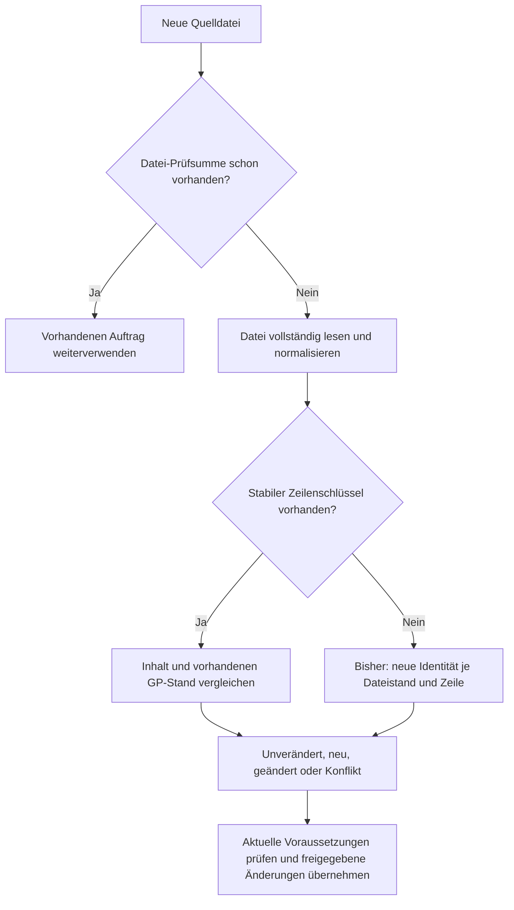

# Datenbankimport: Messungen, Ursachen und Optimierung

Stand: 15./16.09.2026. Ziel: ungefähr 30 Minuten je vollständiger Quelldatenbank.
Ausgangspunkt: `40caa8f993f307d5dbb01efa83d3130c432281a1`, v0.92.53-beta.
Die Messungen dokumentieren den lokal qualifizierten Optimierungsstand für
v0.92.54. Den produktiven Veröffentlichungsstand und dessen eigene Prüfungen
dokumentiert der zugehörige Releasebericht.

## Ergebnis der Analyse

Das Lesen der Access-Dateien erklärt die bisherigen Tageslaufzeiten nicht. Die
Hauptarbeit entsteht danach: sehr viele einzelne SQL-Abfragen, verschlüsselte
Zwischenstände, erneute Prüfungen vor der Übernahme und die Speicherung neuer
Versionen. Dazu kommen Wartezeiten zwischen den drei voneinander abhängigen
Importaufträgen und Unterbrechungen durch Wartung. Verstrichene Auftragszeit und
tatsächliche Verarbeitungszeit müssen deshalb getrennt ausgewiesen werden.

Eine exakt gleiche Datei wird bereits anhand ihrer SHA-256-Prüfsumme erkannt und
dem vorhandenen Auftrag zugeordnet. Bei einer veränderten Datei wird dagegen der
gesamte relevante Inhalt erneut verarbeitet. Bei Tabellen mit stabilen Schlüsseln
erkennt der Vergleich unveränderte Zeilen und schreibt keine neue fachliche
Version. Die dafür nötige Prüfung war jedoch unnötig teuer.

Bei Tabellen ohne stabilen Schlüssel steckt zusätzlich der Dateistand im
Zeilenschlüssel. Ein neuer Dateistand erzeugt dort neue Identitäten. Das betrifft
ausgerechnet große Teile von Trade und Bestell. Ein schneller SQL-Import und ein
echter Import nur der Änderungen sind daher zwei zusammengehörige Arbeiten.

Die vollständigen lokalen Messungen des ersten Optimierungsstands ergeben:

| Datenbank | Umfang | Gemessener Abschluss | Zeit |
| --- | ---: | --- | ---: |
| Trade | 396.466 Zeilen | geprüft und übernommen | **35 min 14 s** |
| Bestell | 414.434 Zeilen | geprüft und übernommen | **38 min 00 s** |
| Kasse | 1.087.650 Zeilen | geprüft und lokal freigegeben, synthetische Zuordnung | **8 min 23 s** |

Das ist eine deutliche Annäherung an das gewünschte Zeitbudget. Die 30 Minuten
einschließlich Upload und tatsächlicher VPS-Last sind damit noch nicht nachgewiesen.
Trade und Bestell messen den ersten Optimierungsstand. Die später ergänzten
Einsparungen bei Core-Abfragen, unveränderten Prüfplänen und Hintergrund-Statusabfragen
sind dort noch nicht enthalten. Die Kassenzeile zeigt die abschließende Messung
einschließlich lokaler Freigabe; deren genaue Testkonfiguration folgt unten.

## 1. Was tatsächlich gemessen wurde

Die drei Originaldateien wurden unverändert nach `tmp/import-performance-20260915/sources`
kopiert und per SHA-256 verglichen. Berichte enthalten ausschließlich Zähler,
Tabellennamen und Laufzeiten. Kundendaten, Umsätze, Zugangsdaten und Schlüssel
werden nicht ausgegeben.

Der beanstandete, fehlgeschlagene Bestell-Auftrag am VPS enthält eine Datei mit
derselben SHA-256-Prüfsumme wie Trade_Daten. Er ist als Bestell zugeordnet und
stoppt deshalb mit `IMPORT_SOURCE_TABLE_UNCLASSIFIED`. Die richtige lokale
Trade_DatenBestell-Datei ist dagegen etwa 136 MB groß und enthält 414.434 Zeilen;
sie wurde im vollständigen Test erfolgreich geprüft und übernommen. Die falsche
Zuordnung und die Laufzeitoptimierung sind zwei getrennte Ursachen. Eine verständlichere
Meldung bei einer bereits als anderer Datenbanktyp bekannten Datei wäre eine
sinnvolle zusätzliche Bedienverbesserung.

### Reines Dateilesen einschließlich der bestehenden Feldaufbereitung

| Quelle | Größe | Fachliche Tabellen | Gelesene Zeilen | Lokale Lesezeit |
| --- | ---: | ---: | ---: | ---: |
| Trade_Daten | 265.719.808 Byte | 102 | 396.466 | 7,77 s |
| Trade_DatenBestell | 136.056.832 Byte | 21 | 414.434 | 6,27 s |
| Kassen_Umsätze | 331.485.184 Byte | 7 | 1.087.650 | 73,16 s |

Messung mit dem bereits verwendeten `mdb-reader 3.2.0`, Node 24.19.0, Windows.
Kein Upload und keine Datenbankspeicherung in dieser Messung. Der Worker zählt
aktive Datensätze und behält die Gegenprüfung mit den deklarierten Zeilenzahlen.
Die Dateiprüfsummen wurden nach dem Lesen erneut geprüft. Der Reader verändert
seinen verwerfbaren Arbeitspuffer; das ist keine Änderung der Quelldatei.

Bei der Kasse entfallen rund 30 Sekunden auf `Tagesbericht` und 40 Sekunden auf
`Umsatz_Kasse_Details`. Der Reader läuft bei seitenweisen Offset-Abfragen wieder
über Teile der Seitenstruktur. Ein Cursor wäre effizienter; selbst die gesamte
gemessene Lesezeit liegt aber deutlich unter dem Zeitbudget.

### Vergleich mit einer echten lokalen PostgreSQL-Instanz

Für die SQL-Messung wurde PostgreSQL 18.6 als separates Testsystem auf diesem PC
gestartet: ausschließlich Loopback, eigene zufällige Kennwörter, zwei leere
Testdatenbanken, bestehende GP-Migrationen und Rollen. Es wurde kein Windows-Dienst
installiert. Die Messung benutzt den regulären Import-Runtime, die regulären
Transaktionen, Verschlüsselung und Writer.

Der VPS verwendet Node 22.22.1. Die abschließenden Vergleichsläufe wurden deshalb
lokal mit derselben Node-Version wiederholt. Die ursprünglichen Programmdateien
werden für den Vorher-Lauf lesend aus dem genannten Git-Commit geladen; der
Arbeitsstand wird dafür nicht zurückgesetzt.

Der lokale PC hat einen Intel i7-11700F mit 8 Kernen/16 logischen Prozessoren und
63,8 GiB RAM. PostgreSQL verwendet im separaten Testcluster 128 MB Shared Buffers.
Das ist ausdrücklich kein Nachbau der VPS-Hardware.

Jeweils 1.000 synthetische Datensätze in einer repräsentativen Tabelle, übrige
Tabellen leer. Ein zweiter Dateistand verändert genau zehn Zeilen. Das misst die
Mechanik, nicht den tatsächlichen Änderungsanteil der gelieferten Datenbanken.

| Quelle / Testtabelle | Erster Lauf vorher | Erster Lauf nachher | 1-%-Änderung vorher | 1-%-Änderung nachher |
| --- | ---: | ---: | ---: | ---: |
| Trade / KUNDEN | 39,19 s | 13,67 s | 23,23 s | 12,04 s |
| Bestell / Reparatur | 19,53 s | 5,77 s | 15,22 s | 5,96 s |
| Kasse / Umsatz_KASSE | 1,03 s | 0,56 s | 0,76 s | 0,43 s |

Trade und Bestell enthalten Einlesen/Bereitstellen, Prüfung und Übernahme samt
erneuter Prüfung vor der Übernahme. Die Kassenmessung endet beim vollständig
geprüften Kandidaten; die spätere Kassenfreigabe ist ein eigener Ablauf.

Bei Trade und Bestell bleiben jeweils 990 Zeilen fachlich unverändert; genau zehn
werden aktualisiert. Eine identische Datei benötigt im synthetischen Lauf nur
wenige Millisekunden. Bei echten Dateien kommen Dateilesen und Hashbildung hinzu.

Besonders deutlich ist die Verringerung der Abfragen im Bestell-Vergleich:

- Bereitstellen: 4.053 → 753 SQL-Aufrufe.
- Prüfung: 13.700 → 670 SQL-Aufrufe.
- Übernahme einschließlich erneuter Prüfung: 15.238 → 2.085 SQL-Aufrufe.

Die Tabellenanzahl verursacht einen festen Aufwand. Die Werte dürfen daher nicht
einfach mit der Zahl aller Datensätze multipliziert werden. Windows-Dateisystem,
CPU, lokaler PostgreSQL-Server und leere Testdatenbanken unterscheiden sich
zusätzlich vom VPS. Diese kleinen Läufe sind kein Nachweis der 30-Minuten-Grenze.

Die Nachher-Spalte wurde abschließend mit dem zuletzt geänderten Code gemessen.
Vorher und nachher verwenden dieselbe direkte Zusammensetzung der zwei
Testdatenbanken. Die zusätzliche Server-Verbindungsschicht ist separat mit nativen
Funktionstests geprüft; ihre Laufzeit sowie der Hintergrundarbeiter sind hier
nicht enthalten.

### Vollständige Kassen-Datei

Mit der echten, hashgeprüften Kopie von `Kassen_Umsätze.accdb` wurde anschließend
der reguläre Reader-Worker mit dem vollständigen PostgreSQL-Import ausgeführt:

| Schritt | Ergebnis |
| --- | ---: |
| Lesen und verschlüsselt bereitstellen | 5 min 37,94 s |
| Sämtliche Zeilen erneut prüfen | 3 min 10,36 s |
| Gesamt bis vollständig geprüft | **8 min 48,30 s** |
| Verifizierte Zeilen | **1.087.650 von 1.087.650** |
| Längstes gemessenes Nachrichtenpaket beim Bereitstellen | 151 ms |
| Exakt gleiche Datei erneut anbieten, einschließlich lokalem Lesen | 324 ms |

Der gemessene Endzustand ist `ready`. Der Test enthält alle Tabellen, Elternbelege,
verschlüsselten Werte, Prüfsummen und gespeicherten Fortschritte. Netzwerk-Upload,
Kassenveröffentlichung, Produktionsbestand und VPS-Last sind nicht enthalten.
Die PostgreSQL-Testdatenbank belegte vor der anschließenden Bereinigung rund
1,25 GB. Ein voller Vorher-Lauf der Kasse wurde nicht durchgeführt; aus diesem
Ergebnis wird deshalb kein vollständiger Vorher-/Nachher-Faktor behauptet.

Im anschließenden zusammenhängenden Test hinter Trade und Bestell brauchte dieselbe
Kassen-Datei **8 min 22,69 s**: 5 min 25,59 s fürs Bereitstellen und 2 min 56,93 s für
die Prüfung. Wieder wurden alle 1.087.650 Zeilen verifiziert. Die Testdatenbank
belegte mit allen drei Importen zusammen rund 9,44 GB. Das längste Runtime-Paket
dauerte 829 ms. Diese Messungen zeigen zugleich die normale Streuung lokaler
Laufzeiten.

### Abschließender Kassenlauf einschließlich Freigabe

Mit dem zuletzt geänderten Code wurde die echte Kassen-Datei nochmals vollständig
eingelesen, geprüft und in der isolierten Testdatenbank für Auswertungen aktiviert:

| Schritt | Dauer |
| --- | ---: |
| Lesen und verschlüsselt bereitstellen | 5 min 11,54 s |
| Vollständige Prüfung | 3 min 05,54 s |
| Freigabevorschau | 2,47 s |
| Freigabe ausführen | 2,73 s |
| Freigabe einschließlich Zuordnungssuche und Abschlusskontrolle | 5,38 s |
| **Gesamt einschließlich Freigabe** | **8 min 23,12 s** |

Die Übersicht verwendet diesen abschließenden Kassenlauf. Alle 1.087.650 Zeilen
sind verifiziert; die aktivierte Veröffentlichung wurde nochmals über den
regulären Runtime gelesen. Der längste normale Runtime-Arbeitsschritt dauerte
741 ms. Die abschließende Veröffentlichung ist in den gesonderten Zeiten enthalten.

Die Testfreigabe verwendet **eine synthetische Filialzuordnung**. Die automatische
Artikelauflösung läuft gegen einen leeren operativen Artikelkatalog; es entsteht
deshalb nur diese eine Zuordnung. Die gemessenen fünf Sekunden sind kein Nachweis
für die Freigabe mit allen bestehenden produktiven Artikel- und Personalzuordnungen.
Netzwerk, Hintergrundarbeiter, produktive Benutzerauflösung und VPS-Last bleiben
auch bei dieser vollständigen lokalen Messung ausgeschlossen.

Der VPS wurde lesend mit vier verfügbaren CPUs, 7,75 GiB RAM und etwa 75 GiB freiem
Datenträgerplatz festgestellt. Das ist kein Anlass, zuerst neue Hardware zu kaufen.
Die verbleibende Qualifizierung muss auf vergleichbarer Linux-Hardware und mit
dem bestehenden Datenbestand erfolgen.

### Vollständige Trade-Datei einschließlich Übernahme

Der zusammenhängende lokale Lauf übernahm alle 396.466 Zeilen erfolgreich:

| Schritt | Dauer |
| --- | ---: |
| Lesen und verschlüsselt bereitstellen | 4 min 05,77 s |
| Erste vollständige Prüfung | 5 min 21,04 s |
| Übernahme einschließlich erneuter Prüfung | 25 min 47,20 s |
| **Gesamt** | **35 min 14,29 s** |
| Exakt gleiche Datei nochmals anbieten | 259 ms |

Endzustand: `applied`; 396.466 von 396.466 Zeilen verarbeitet. Der längste
gemessene Runtime-Arbeitsschritt betrug 752 ms; das längste Reader-Nachrichtenpaket
1.113 ms. Die Testdatenbank belegte danach rund 4,25 GB einschließlich ihrer Indizes
und des während dieses Laufs entstandenen freien Platzes in Tabellen.

Rund 8 min 14 s der Übernahme entfallen auf das Zurücksetzen und erneute Erstellen
von Prüfplänen. Die restliche Übernahme benötigt rund 17 min 31 s. Die Zuordnung
zu diesen Unterphasen folgt den Runtime-Fortschrittsmarken und ist deshalb geringfügig
ungenauer als die separat gemessene Gesamtzeit.

Damit liegt dieser vollständige Erstimport noch gut fünf Minuten über 30 Minuten.
Upload, Hintergrundarbeiter und VPS-Last kommen dazu. Die zusätzliche Paketabfrage
der Core-Zuordnungen und das Beibehalten unveränderter verschlüsselter Prüfpläne
bei der Übernahme wurden während dieses langen Messlaufs ergänzt und anschließend
separat geprüft; sie sind in dieser Zeit noch nicht enthalten. Die Zahl ist kein Nachweis,
dass der endgültige Arbeitsstand am VPS bereits unter 30 Minuten bleibt.

### Vollständige Bestell-Datei einschließlich Übernahme

Der anschließende Lauf verwendet dieselben Testdatenbanken und die zuvor
importierten Trade-Stammdaten. Alle 414.434 Bestell-Zeilen wurden übernommen:

| Schritt | Dauer |
| --- | ---: |
| Lesen und verschlüsselt bereitstellen | 2 min 45,18 s |
| Erste vollständige Prüfung | 6 min 32,96 s |
| Übernahme einschließlich erneuter Prüfung | 28 min 41,83 s |
| **Gesamt** | **38 min 00,22 s** |
| Exakt gleiche Datei nochmals anbieten | 140 ms |

Endzustand: `applied`; danach sind insgesamt 810.900 Trade- und Bestell-Zeilen
übernommen. Der längste gemessene Runtime-Arbeitsschritt dauerte 571 ms, das längste
Reader-Nachrichtenpaket 296 ms. Die Testdatenbank belegt jetzt rund 8,21 GB;
dieser Wert enthält Trade und Bestell zusammen.

Rund 8 min 55 s entfallen innerhalb der Übernahme auf die erneute Prüfung samt
Zurücksetzen, rund 19 min 45 s auf das eigentliche Übernehmen. Der vollständige
Import der richtigen Bestell-Datei funktioniert somit im Test. Für die Einordnung
gelten dieselben Grenzen wie bei Trade: lokaler Erstimport, erster Optimierungsstand,
keine Upload-, Warteschlangen- oder VPS-Qualifizierung.

## 2. Der entscheidende Punkt beim Import nur der Änderungen

### Wann eine erneute Prüfung entfallen darf

Die Prüfung vor der Übernahme darf nicht einfach entfernt werden. Beim ersten
Trade-Import fehlen anfangs noch Stammdaten, die frühere Tabellen desselben Imports
erst anlegen. Bereits geprüfte historische Zeilen brauchen danach aktualisierte
Verweise. Auch GP-Zuordnungen können sich ändern, während die Quelldatei gleich bleibt.

Die einzelnen Schreibvorgänge prüfen ihre Voraussetzungen zwar nochmals. Zeilen,
die schon als unverändert eingestuft wurden, sind aber gar nicht in dieser
Schreibwarteschlange. Allein auf die Schreibprüfung zu vertrauen würde diese Zeilen
übersehen. Der lokale Optimierungsblock behält daher die erneute Prüfung bei.

Für das gezielte Überspringen braucht es einen belastbaren Änderungsnachweis für
die betroffenen Stammdaten, Zuordnungen und Ziele. Geeignet sind transaktionale
Änderungszähler zusammen mit geschützten Inhaltsnachweisen. Ein Datum, die
verstrichene Zeit seit dem letzten Import oder verzögert aktualisierte
PostgreSQL-Statistiken reichen dafür nicht. Dieser größere Schritt muss auch
Änderungen, Rücknahmen, Löschungen und zwischenzeitlich zurückgeänderte Werte erfassen.

### Trade: Artikel je Filiale

`ARTIKEL_FILIALEN` enthält 233.197 Zeilen, also etwa 59 % der Trade-Zeilen.
Das aktuelle Profil verwendet eine Kombination aus Datei-Prüfsumme und
Zeilennummer. Damit wird jede neue Datei zu einem neuen Bestand dieser Tabelle.

Die aktuelle Datei wurde vollständig auf einen fachlichen Schlüssel geprüft:

- `EAN + FilialID`: 233.197 eindeutige Kombinationen, keine fehlenden Schlüssel,
  keine Doppelbelegungen.
- Auch vollständig identische doppelte Zeilen wurden nicht gefunden.

Das ist ein sehr guter Kandidat für einen stabilen Schlüssel. Die Eindeutigkeit
eines Dateistands beweist allerdings noch nicht die langfristige Stabilität.
Vor einer Umstellung müssen mindestens ein weiterer Dateistand und die bereits
importierten Bestände geprüft werden. Anschließend braucht es eine versionierte
Profilumstellung mit einer eindeutigen Zuordnung der vorhandenen Datensätze,
Referenzen und Rücknahmen. Nur das Profilfeld umzuschalten würde die alte Historie
von der neuen Identität abtrennen.

Die heutigen Leser erwarten zudem den exakten Profilfingerabdruck einer Tabelle.
Vor dem ersten Schreiben mit einem neuen Schlüssel müssen sie alte und neue
Profilversionen gezielt lesen können. Diese Lesbarkeit ist Teil der Migration;
eine bloße Änderung der Schlüsseldefinition reicht nicht.

### Bestell: Rechnungsdetails und Teilzahlungen

`Rechnungsdetails_Z` enthält 181.125 Zeilen, etwa 44 % aller Bestell-Zeilen.
Die naheliegenden Schlüsselkandidaten sind nachweislich nicht eindeutig:

| Kandidat | Eindeutige Kombinationen | Weitere Zeilen mit gleicher Kombination |
| --- | ---: | ---: |
| aid | 70.008 | 111.117 |
| Rechnungsnr + aid | 172.512 | 8.613 |
| Rechnungsnr + Position | 103.530 | 77.595 |
| Rechnungsnr + Filialid + aid | 172.543 | 8.582 |

Die 12.581 Teilzahlungen enthalten sogar ein Paar vollständig identischer Zeilen.
Auch ein Inhaltshash darf deshalb nicht als alleiniger eindeutiger Schlüssel
verwendet werden. Identische Zeilen können echte, getrennte Geschäftsvorgänge sein.

Für solche Tabellen ist ein Vergleich von **Inhalt und Häufigkeit** geeignet:
Ein neuer Dateistand enthält pro normalisiertem Inhalt die Anzahl der Vorkommen.
Unveränderte geschützte Inhalte können wiederverwendet werden, während der neue
Dateistand ihre Zugehörigkeit und Reihenfolge belegt. Änderungen und neue
Vorkommen werden ergänzt. Dabei wird keine fachliche Identität erfunden.

Die vorhandenen gemeinsamen verschlüsselten Belegblöcke sind dafür eine Grundlage.
Sie sparen bereits doppelte große Inhalte; sie vermeiden derzeit aber noch nicht
alle neuen Datensätze, Beziehungen und Änderungsbelege eines neuen Dateistands.

### Kasse

Die Kasse besitzt schon einen kompakteren Importweg. Trotzdem wird bei jeder
geänderten Datei ein vollständiger neuer, verschlüsselter Kandidat erstellt und
geprüft. Teile der Kasse haben belastbare Schlüssel, andere nicht.

Ein reines „alles nach dem letzten Datum“ wäre unzureichend: rückdatierte oder
verspätete Buchungen, Stornos und Korrekturen könnten fehlen. Das kostengünstige
vollständige Lesen und Hashen sollte bleiben. Teure Verarbeitung soll sich auf
neue/geänderte Inhalte und betroffene Abhängigkeiten beschränken. Der alte
Kassenstand bleibt bis zur vollständigen Freigabe aktiv.

## 3. Lokal umgesetzter Optimierungsblock

Die Änderungen verwenden die vorhandene PostgreSQL-Verbindung und SQL-Funktionen;
es wird keine neue Produktabhängigkeit installiert und kein Schema verändert.

1. **Paketweises Bereitstellen:** bis zu 200 Zeilen pro Transaktion, einschließlich
   Konflikten innerhalb eines Pakets und gegenüber bereits gespeicherten Zeilen.
2. **Gemeinsame Belegblöcke im Paket:** fehlende verschlüsselte Blöcke gesammelt
   schreiben, danach gespeicherte Blöcke tatsächlich zurücklesen und authentifizieren.
   Auch ein bereits vorhandener Block muss unverändert zur erwarteten Identität passen.
3. **Prüfung im Paket:** Zeilenbelege, Verweise, vorhandene Importverknüpfungen,
   Stammdaten und historische Versionen gesammelt lesen. Prüfpläne gesammelt speichern.
   Die Zuordnungen in der getrennten Core-Datenbank erhalten einen eigenen
   lesenden Paketkatalog; sie werden nicht in die falsche Datenbank verschoben.
4. **Transaktionsgebundene Wiederverwendung:** wiederholte Datenbanklesevorgänge
   und bereits erfolgreich authentifizierte, unveränderliche Werte innerhalb
   derselben Transaktion wiederverwenden. Vollständiger Datensatzkopf und konkrete
   Schutzinstanz sind Teil des Schlüssels. Nach einer Änderung werden die betroffenen
   Einträge verworfen. Fehlgeschlagene Prüfungen werden nicht gespeichert.
   Berechtigungen und Ergebnisse anderer Transaktionen werden nicht als unverändert
   vorausgesetzt.
5. **Kassenpakete:** Elternbelege gesammelt laden und prüfen, danach verschlüsselte
   Zeilen gemeinsam schreiben. Ein fehlender Elternbeleg oder doppelter Schlüssel
   verwirft das gesamte betroffene Paket.
6. **Paketweise Übernahme neuer Datensätze:** bis zu 50 neue Ziele samt Segmenten,
   Beziehungen, Importverknüpfungen und Rücknahmebelegen gemeinsam schreiben.
   Zuerst werden alle aktuellen Voraussetzungen geprüft; danach werden die tatsächlich
   gespeicherten Ziele zurückgelesen und authentifiziert. Gemischte Pakete und
   Aktualisierungen verwenden weiterhin die vorhandene einzelne Schreiblogik.
   Historische Referenzen bleiben wirksame Lösch- und Rücknahmesperren.
7. **Unveränderte Prüfbelege erhalten:** Die Übernahme eines Pakets neuer Datensätze
   ändert den Zeilenzustand, nicht den zuvor authentifizierten Prüfplan. Dessen
   verschlüsselter Inhalt und Verweise bleiben deshalb erhalten. Neue Zielwerte,
   Verknüpfungen und Rücknahmebelege werden weiterhin vollständig geschrieben und
   geprüft; das erneute Verschlüsseln und Übertragen des unveränderten Plans entfällt.
8. **Bestätigten Fortschritt weiterverwenden:** Der Hintergrundarbeiter verwendet
   den zurückgegebenen Auftragsstand für den nächsten Arbeitsschritt. Berechtigungen
   und erwartete Revision werden dort weiterhin aktuell geprüft. Vor Abschluss
   sowie nach Wiederaufnahme oder Neustart liest er den gespeicherten Zustand erneut.
   Eine zusätzliche vollständige Statusabfrage zwischen jedem Paket entfällt.

Die neuen SQL-Pakete werden nur für Anwendungsinstanzen mit dem passenden
Laufzeitkatalog aktiviert. Ältere Migrationsstufen und eigene Testadapter behalten
den bisherigen Weg. Pakete sind begrenzt; ein vollständiger Import wird nicht in
eine einzige große Transaktion verlagert.

Auch die im Server verwendete verzögert öffnende Verbindungsschicht wird ausdrücklich
markiert, bevor die Importdienste entstehen. Eine Aktivierung allein an der inneren
Testverbindung würde an dieser Schicht verloren gehen. Die nativen Tests beziehen
deshalb auch diese produktive Zusammensetzung einschließlich Rücknahme ein.

Identitäten, Dezimalwerte, lokale Access-Zeitangaben, Verschlüsselungsformate,
Integritätsprüfungen, fortlaufende Zähler, Wiederaufnahme und Rücknahme bleiben
verbindlich. Die historischen Migrationskataloge wurden nicht neu geschrieben.
Der normale SQLite-Weg bleibt lesbar und ausführbar.

### Prüfungen

- Abschließende Import-Regressionsauswahl mit Node 22.22.1: **264 bestanden,
  kein Fehler, keine übersprungene Prüfung**; Laufzeit rund 217 Sekunden.
- Vier neue Tests mit PostgreSQL 18.6 und Node 22.22.1 bestanden: Paketkonflikte,
  wiederholte Bestätigungen, unveränderliche Belegblöcke, beschädigte verschlüsselte
  Zeilen, 1-%-Änderungen, Änderung zwischen Prüfung und Übernahme, Rücknahme,
  Kassen-Elternbelege, ein Fehler nach dem Schreiben sämtlicher Stammdaten eines
  Pakets, vollständiges Zurückrollen, historische Referenzsperren und Freigabe der
  Koordinationssperre. Zwei dieser Tests verwenden die zusätzliche Verbindungsschicht
  des produktiven Servers. Das Muster zum Zählen der Core-Abfragen wurde korrigiert;
  der betroffene Test bestand danach in der gezielten Wiederholung.
- Ein eigener Schutztest prüft die Grenzen der authentifizierten Wiederverwendung:
  andere Transaktion, anderer Schlüssel, geänderter Datensatzkopf, Schreibinvalidierung
  und erneut ausgeführte fehlgeschlagene Authentifizierung.
- Der bestehende native Recheck-Test mit 30.567 Zeilen bestand ebenfalls:
  **insgesamt fünf verschiedene native Prüfungen bestanden**. Er erhält die beiden
  absichtlich ungültigen/konflikthaften Zeilen und prüft die Zähler sowie die
  freigegebene Koordinationssperre nach jedem der 153 Pakete.
- Die vollständigen echten Dateien wurden erfolgreich verarbeitet: Trade und
  Bestell bis `applied`, Kasse bis `ready`; insgesamt **1.898.550 Quellzeilen**.
- Der zusätzliche Kassenlauf einschließlich Vorschau, Aktivierung und erneuter
  Kontrolle der aktiven Veröffentlichung bestand ebenfalls; siehe Testkonfiguration oben.
- Wiederverwendeter Auftragsfortschritt umgeht keinen Rechteentzug: Ein Entzug
  zwischen zwei Paketen stoppt den nächsten Schreibschritt. Der Abschluss wird
  nochmals aus dem gespeicherten Zustand gelesen.

Ein zusätzlich geprüfter alter Katalog-Abnahmetest scheitert bereits im unveränderten
Ausgangscommit: Er erwartet 1.371 Deklarationen, der dortige SQLite-Katalog enthält
1.398. Der identische Fehler wurde mit dem Ausgangscode reproduziert. Diese ältere
Abnahmezahl wurde im Import-Optimierungsblock nicht geändert; sie ist kein durch
die neuen SQL-Pakete erzeugter Fehler.

## 4. Open-Source-Werkzeuge

| Werkzeug | Nutzen für GP | Einschätzung / Entscheidung |
| --- | --- | --- |
| mdb-reader, MIT, bereits vorhanden | Direktes Lesen von ACCDB in Node | Behalten. Die gemessenen Lesezeiten rechtfertigen keinen sofortigen Austausch. [Projekt](https://github.com/andipaetzold/mdb-reader) |
| PostgreSQL `jsonb_to_recordset`, bereits vorhanden | Viele vorbereitete Zeilen in einem SQL-Aufruf verarbeiten | Bereits für den lokalen Optimierungsblock verwendet. Keine zusätzliche Laufzeit oder Bibliothek. [Dokumentation](https://www.postgresql.org/docs/18/functions-json.html) |
| PostgreSQL `COPY` / pg-copy-streams, MIT | Sehr große Mengen mit wenig Protokollaufwand übertragen | Geeigneter nächster Vergleich für die reine Bereitstellung. Erst nach Messung gegen begrenzte SQL-Pakete; Integration muss bestehende Transaktions- und Prüfgrenzen beachten. [PostgreSQL](https://www.postgresql.org/docs/18/populate.html), [Bibliothek](https://github.com/brianc/node-pg-copy-streams) |
| Jackcess, Apache 2.0 | Separater Java-Reader, Cursor und unabhängiger Wertevergleich | Sinnvoll als Referenzleser und mögliche spätere Reader-Alternative. Zusätzliche Java-Laufzeit und Prüfung aller Datentypen erforderlich; nicht für diesen Block eingebaut. [Projekt](https://jackcess.sourceforge.io/), [Lizenz/FAQ](https://jackcess.sourceforge.io/faq.html) |
| MDB Tools, GPL/LGPL | Native Werkzeuge wie mdb-export; weitere unabhängige Prüfung | Eher Diagnosewerkzeug. CSV-/SQL-Exporte müssen NULL, Leerwerte, Steuerzeichen, Zahlen und Datumswerte exakt erhalten. Kein direkter Ersatz für GP-Verschlüsselung, Rechte und Historie. [Projekt](https://github.com/mdbtools/mdbtools) |
| access-export-jack, MIT | Jackcess-basierter Export, auch nach PostgreSQL | Zusätzliche kleine Wrapper-Abhängigkeit ohne Lösung der GP-Vergleichs- und Historienlogik. Derzeit kein ausreichender Vorteil. [Projekt](https://github.com/kaliatech/access-export-jack) |

Die geringe Anzahl neuer Abhängigkeiten begrenzt Wartung und Angriffsfläche.
Ein Open-Source-Name allein ist kein Sicherheitsnachweis. Vor einer zusätzlichen
Reader-Integration gehören feste Version, Lizenzprüfung, Prüfung der Abhängigkeiten,
Prozessgrenzen und Wertevergleich aller drei Quellen zur Freigabe.

## 5. Belastbarer Weg zur halben Stunde

Die Abnahme muss Upload, Warteschlange, Lesen, Bereitstellen, Prüfen und Freigabe
getrennt messen. Für die Arbeitszeit sind mindestens folgende Fälle relevant:

1. Erster vollständiger Import.
2. Exakt gleiche Datei: vorhandenen geprüften Auftrag sofort wiederverwenden.
3. Neue Datei mit unveränderten fachlichen Inhalten, aber anderer Reihenfolge.
4. Rund 1 % neue/geänderte Zeilen.
5. Korrektur einer alten Buchung, Storno, verspäteter Eingang und echte Dubletten.
6. Geänderte GP-Zuordnung bei unverändertem Quellinhalt.
7. Unterbrechung/Wiederaufnahme, Rücknahme und parallel benutzbarer GP.

Ein mögliches Arbeitsbudget je Datei ist 3 Minuten Übertragung, 2 Minuten Lesen,
5 Minuten Bereitstellung und Vergleich, 15 Minuten geänderte Daten samt Prüfung
und 5 Minuten Abschluss/Reserve. Das ist eine Zielaufteilung, keine Messung.
Bei langsamer Übertragung muss zusätzlich die tatsächliche Netzzeit sichtbar sein.

Der Hintergrundarbeiter gibt zwischen Arbeitsschritten für 25 ms frei. Das erhält
die Bedienbarkeit von GP, kostet bei
beispielsweise 8.000 Schritten aber allein rund 200 Sekunden. Die hier dokumentierten
Runtime-Messungen schließen diese Warteschlange, die verschlüsselte Upload-Zwischendatei und
die Auflösung des produktiven Benutzerkontos nicht ein. Die ursprüngliche zusätzliche
Statusabfrage vor jedem Paket wird im lokalen Arbeitsstand eingespart; dieser
Zusatzgewinn ist in den Runtime-Messungen ebenfalls nicht enthalten. Diese Teile müssen bei der
VPS-Abnahme zusätzlich gemessen werden. Es gibt keinen künstlichen mehrsekündigen
Wartezyklus nach jeder Zeile; längere Wartezeiten entstehen bei Wiederholungen nach
Fehlern, Wartung und vorangestellten Aufträgen.

Die nächste größere Änderung sollte die Wiederverwendung unveränderter Inhalte
für neue Dateistände umsetzen. Bei `ARTIKEL_FILIALEN` ist außerdem ein stabiler
fachlicher Schlüssel gut begründet; bei Rechnungsdetails und Teilzahlungen muss
die Mehrfachheit von Inhalten erhalten bleiben. Pauschales Weglassen alter Daten
oder eine Änderung bestehender Schlüssel ohne Migration würde die Zeitgrenze mit
einem fachlichen Fehler erkaufen.

Empfohlene Reihenfolge:

1. Den vorliegenden Optimierungsblock für die drei vollständigen Dateien auf
   vergleichbarer Linux-Hardware und anschließend im freigegebenen VPS-Ablauf
   qualifizieren. Erst diese Messung entscheidet über das 30-Minuten-Ziel im Betrieb.
2. Mindestens zwei unterschiedliche echte Dateistände und die vorhandenen
   Importidentitäten gegeneinander prüfen. Daraus folgen die erlaubten stabilen
   Schlüssel und die Tabellen, die weiterhin vollständige Dateistände benötigen.
3. Profilversionen, Zuordnung alter Identitäten und Wiederverwendung von Inhalt
   samt Häufigkeit implementieren. Quellenherkunft, historische Ansichten,
   Korrekturen und Rücknahmen müssen dabei auflösbar bleiben.
4. Erst danach weitere Lesewerkzeuge oder COPY anhand verbleibender gemessener
   Engpässe einbauen. Der Austausch des Access-Readers allein ist nicht die Priorität.

Die Punkte 2 und 3 sind analysiert, aber noch nicht implementiert. Der vorliegende
Arbeitsstand enthält keine versteckte Änderung bestehender fachlicher Schlüssel.

## Nachweise und Wiederholbarkeit

Lokal unter `tmp/import-performance-20260915` liegen Dateimanifest,
Reader-Messungen, Vorher-/Nachher-Läufe mit Node 22, Identitätsanalyse,
Testprotokolle und die vollständigen Dateiläufe einschließlich Kassenfreigabe.
Dieser Ordner enthält auch die
privaten Testdatenbank-Zugangsdaten und gehört nicht in Git oder ein öffentliches
Artefakt. Die ausführbaren Messskripte liegen unter `scripts/benchmark-*.cjs` und
`scripts/analyze-import-identities.cjs`.

Während der Analyse wurde der VPS nur lesend beobachtet. Laufende Importe,
Produktionsdatenbank, Zugangsregeln und Deploymentstand wurden in dieser Phase
nicht verändert. Die anschließend beauftragte Veröffentlichung und ihre
Abschlussprüfung sind im [Release-Nachweis v0.92.54](DEPLOY-RELEASE-v09254.md)
getrennt dokumentiert.
Der eigens gestartete lokale PostgreSQL-Testcluster wurde nach erfolgreicher
Prüfung seiner Kennung und der Testdatenbereinigung wieder beendet.
